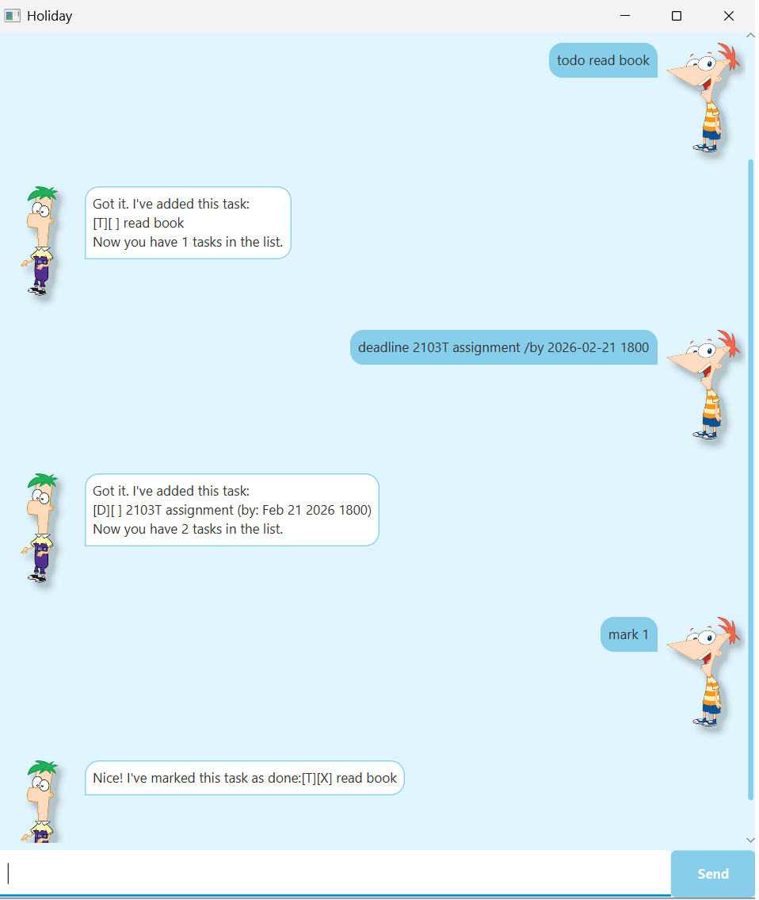

# Holiday User Guide



Holiday is a  CLI-based task management bot that helps you to keep track of your tasks and event. It is designed for users who prefer to manage their tasks via a command-line interface, while still providing a user-friendly experience.

---

## Quick Start

1. Ensure you have **Java 17 or above** installed on your computer.

2. Download the latest `.jar` file 

3. Copy the file to the folder you want to use as the home folder for Holiday.

4. Open a command terminal, `cd` into the folder you put the jar file in, and use the `java -jar holiday.jar` command to run the application.
   
5. A GUI similar to the screenshot above should appear in a few seconds. The app starts with an empty task list.

6. Type a command in the text field and press Enter or click Send to execute it.


## Features

> **information_source: Notes about the command format:**
>
> - Words in `UPPER_CASE` are the parameters to be supplied by the user.
>   - e.g., in `todo DESCRIPTION`, `DESCRIPTION` is a parameter which can be used as `todo read book`.
>
> - Items in square brackets are optional.
>   - e.g., `find KEYWORD [MORE_KEYWORDS]` can be used as `find book` or as `find book assignment`.
>
> - Date and time must be in the format `YYYY-MM-DD HHmm`.
>   - e.g., `2026-02-21 2359` represents February 21, 2026 at 11:59 PM.
>
> - Commands are case-sensitive.
>
> - Index must be a positive integer 1, 2, 3, ...

---


### Adding a todo task : `todo`

Adds a todo task to the task list.

**Format:** `todo DESCRIPTION`

**Examples:**
- `todo read book`
- `todo buy groceries`

**Example output:**
```
Got it. I've added this task:
  [T][ ] read book
Now you have 1 task in the list.
```

---

### Adding a deadline task : `deadline`

Adds a task with a deadline to the task list.

**Format:** `deadline DESCRIPTION /by YYYY-MM-DD HHmm`

- The deadline must be specified using `/by` followed by the date and time.
- Date and time format: `YYYY-MM-DD HHmm` (e.g., `2026-03-15 2359`)

**Examples:**
- `deadline submit assignment /by 2026-03-15 2359`
- `deadline return library book /by 2026-02-28 1800`

**Example output:**
```
Got it. I've added this task:
  [D][ ] submit assignment (by: Mar 15 2026 2359)
Now you have 2 tasks in the list.
```

---

### Adding an event task : `event`

Adds an event task with a start and end time to the task list.

**Format:** `event DESCRIPTION /from YYYY-MM-DD HHmm /to YYYY-MM-DD HHmm`

- The start time must be specified using `/from` followed by the date and time.
- The end time must be specified using `/to` followed by the date and time.
- Date and time format: `YYYY-MM-DD HHmm` (e.g., `2026-03-15 1400`)

**Examples:**
- `event project meeting /from 2026-03-01 1400 /to 2026-03-01 1600`
- `event conference /from 2026-04-10 0900 /to 2026-04-12 1700`

**Example output:**
```
Got it. I've added this task:
  [E][ ] project meeting (from: Mar 01 2026 1400 to: Mar 01 2026 1600)
Now you have 3 tasks in the list.
```

---

### Listing all tasks : `list`

Shows a list of all tasks in the task list.

**Format:** `list`

**Example output:**
```
Here are the tasks in your list:
1. [T][ ] read book
2. [D][ ] submit assignment (by: Mar 15 2026 2359)
3. [E][ ] project meeting (from: Mar 01 2026 1400 to: Mar 01 2026 1600)
```

---

### Marking a task as done : `mark`

Marks a task as completed.

**Format:** `mark INDEX`

- Marks the task at the specified `INDEX` as done.
- The index refers to the index number shown in the task list.
- The index **must be a positive integer** 1, 2, 3, ...

**Examples:**
- `list` followed by `mark 2` marks the 2nd task as done.
- `mark 1` marks the 1st task as done.

**Example output:**
```
Nice! I've marked this task as done:
  [T][X] read book
```

---

### Unmarking a task : `unmark`

Marks a completed task as not done.

**Format:** `unmark INDEX`

- Unmarks the task at the specified `INDEX`.
- The index refers to the index number shown in the task list.
- The index **must be a positive integer** 1, 2, 3, ...

**Examples:**
- `unmark 1` marks the 1st task as not done.

**Example output:**
```
OK, I've marked this task as not done yet:
  [T][ ] read book
```

---

### Finding tasks by keyword : `find`

Finds tasks whose descriptions contain any of the given keywords.

**Format:** `find KEYWORD [MORE_KEYWORDS]`

- The search is case-sensitive.
- The order of the keywords does not matter.
- Only the task description is searched.
- Tasks matching at least one keyword will be returned (i.e., OR search).

**Examples:**
- `find book` returns tasks containing "book"
- `find book assignment` returns tasks containing "book" or "assignment"

**Example output:**
```
Here are the matching tasks in your list:
1. [T][ ] read book
2. [D][ ] submit assignment (by: Mar 15 2026 2359)
```

---

### Deleting a task : `delete`

Deletes a task from the task list.

**Format:** `delete INDEX`

- Deletes the task at the specified `INDEX`.
- The index refers to the index number shown in the task list.
- The index **must be a positive integer** 1, 2, 3, ...

**Examples:**
- `list` followed by `delete 2` deletes the 2nd task.
- `delete 1` deletes the 1st task.

**Example output:**
```
Noted. I've removed this task:
  [T][ ] read book
Now you have 2 tasks in the list.
```

---

### Sorting tasks : `sort`

Sorts the task list by name or time.

**Format:** `sort by NAME_OR_TIME`

- `sort by name` : Sorts tasks alphabetically by description.
- `sort by time` : Sorts tasks chronologically by date/time (deadlines and events only).

**Examples:**
- `sort by name` sorts tasks alphabetically
- `sort by time` sorts tasks by their due dates/event times

**Example output:**
```
Here are the tasks in your list:
1. [E][ ] project meeting (from: Mar 01 2026 1400 to: Mar 01 2026 1600)
2. [D][ ] submit assignment (by: Mar 15 2026 2359)
3. [T][ ] read book
```

---

### Exiting the program : `bye`

Exits the Holiday application.

**Format:** `bye`

**Example output:**
```
Bye~~ Enjoy your holiday and hope to see you again soon !
```

---


## Command Summary

| Action | Format | Examples |
|--------|--------|----------|
| **Add Todo** | `todo DESCRIPTION` | `todo read book` |
| **Add Deadline** | `deadline DESCRIPTION /by YYYY-MM-DD HHmm` | `deadline submit report /by 2026-03-15 2359` |
| **Add Event** | `event DESCRIPTION /from YYYY-MM-DD HHmm /to YYYY-MM-DD HHmm` | `event meeting /from 2026-03-01 1400 /to 2026-03-01 1600` |
| **List** | `list` | `list` |
| **Mark** | `mark INDEX` | `mark 1` |
| **Unmark** | `unmark INDEX` | `unmark 2` |
| **Find** | `find KEYWORD [MORE_KEYWORDS]` | `find book assignment` |
| **Delete** | `delete INDEX` | `delete 3` |
| **Sort by Name** | `sort by name` | `sort by name` |
| **Sort by Time** | `sort by time` | `sort by time` |
| **Exit** | `bye` | `bye` |
